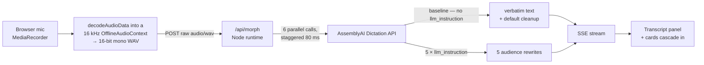

# Voxmorph — speak once, send everywhere

Hold the mic. Say one thing. Get it written for your boss, your team, your users,
your engineers and your family — simultaneously.

Every rewrite is a separate `llm_instruction` on the **AssemblyAI Dictation API**.
There is no other model anywhere in the stack.

> Built for AssemblyAI Voice Hackathon Week, September 2026.

**Live demo:** <https://voxmorph-7ju87p1oj-lack-toes.vercel.app> · **Video:** _(add your link)_

---

## Why this one is different

Most voice-hackathon entries show you a transcript. The Dictation API's actual
differentiator is buried a page deeper: it returns **two** texts from one call.

| field | what it is |
|---|---|
| `text` | the **verbatim** transcript — every "um", every stutter, never altered |
| `llm_response` | the **rewritten** text — a default cleanup, or whatever `llm_instruction` asks for |

Voxmorph is built on that pair:

- **The strike-throughs are real.** The transcript panel diffs `text` against the
  `llm_response` of a call sent with *no* `llm_instruction` — the API's own default
  cleanup. The words struck out are exactly what AssemblyAI's model removed. There
  is no filler-word list in this repo.
- **One utterance, six instructions.** The same audio is sent six times in parallel,
  each with a different `llm_instruction`. Five are audiences; the sixth is the
  no-instruction baseline that powers the diff.

## How it works



**Why the browser converts the audio.** The Dictation API accepts `audio/wav` or
`audio/pcm` only and rejects every `MediaRecorder` container — WebM/Opus, MP4/AAC —
with `415`. Transcoding server-side would mean shipping ffmpeg into a serverless
bundle. Instead `src/lib/audio/wav.ts` decodes the recording into a 16 kHz
`OfflineAudioContext`, which makes `decodeAudioData` resample with the browser's own
polyphase resampler, then writes a 44-byte RIFF header. ~60 lines, no worklet file,
and immune to the Firefox <148 cross-sample-rate bug.

**Why six calls instead of one.** `llm_instruction` is a scalar — one instruction
per request. Six calls also means all six responses carry the same verbatim `text`,
so the transcript survives any five of them failing. `transcriptVariance` in the
`done` event reports whether they ever disagreed. (They haven't.)

## AssemblyAI API surface used

| Feature | How Voxmorph uses it | Where |
|---|---|---|
| `llm_instruction` | The entire product — six per utterance | [`src/config/audiences.json`](src/config/audiences.json) |
| Default cleanup (no instruction) | The baseline call; its `llm_response` is the clean text the diff and every fallback depend on | [`route.ts`](src/app/api/morph/route.ts) |
| `text` vs `llm_response` | Verbatim/Cleaned toggle and the strike-through diff | [`src/lib/diff.ts`](src/lib/diff.ts) |
| `words[].confidence` | Amber dotted underline under low-confidence words | [`TranscriptPanel.tsx`](src/components/TranscriptPanel.tsx) |
| `stt_prompt` | Describes the situation to the ASR before the rewrite | [`src/config/constants.ts`](src/config/constants.ts) |
| `keyterms_prompt` | Biases transcription toward domain vocabulary | [`src/config/constants.ts`](src/config/constants.ts) |
| `language_codes` | Language selector; speak one language, read another | [`CommandCenter.tsx`](src/components/CommandCenter.tsx) |
| `llm_error` | Per-card degradation, including the undocumented `truncated` | [`route.ts`](src/app/api/morph/route.ts) |
| `GET /warm` | Fired on mic press, against the same lambda that will take the audio | [`route.ts`](src/app/api/morph/route.ts) |

## Verify the integration in 30 seconds

```bash
cp .env.example .env.local     # add your ASSEMBLYAI_API_KEY
npm install
npm run smoke                  # real API call, bundled WAV, no browser or mic needed
```

`npm run smoke` pre-warms, makes a baseline call, prints the verbatim/cleaned pair
side by side, fans out all six audiences, and reports wall clock and whether the six
transcripts agreed.

## Run it

```bash
npm run dev     # http://localhost:3000
```

Mic capture needs a secure context, so use `localhost` or an HTTPS URL — a phone
pointed at `http://192.168.x.x:3000` will fail.

| URL | Effect |
|---|---|
| `/` | Opens on a saved example so the page is never empty |
| `/?fresh=1` | Skips the example, opens on the empty state |
| `/?stream=0` | Forces the non-streaming JSON transport |

## What's real and what isn't

- **Real:** every transcript, every rewrite, per-word confidence, the strike-through
  diff, the language switching, copy, edit, and the degraded/retry states. All of it
  is live API output.
- **Saved:** the example shown on first load is a real captured `/api/morph`
  response ([`src/state/demoSeed.ts`](src/state/demoSeed.ts)), labelled as such in
  the UI. `/?fresh=1` skips it.
- **Not simulated anywhere:** there are no canned rewrites, no fake latency, and no
  invented metrics.

## Engineering notes

A few decisions that aren't obvious from the file tree:

- **No `FormData` for the fan-out.** A `FormData` body is single-use, so one
  instance sent to six parallel `fetch` calls leaves five with an empty body. The
  multipart body is a hand-rolled, replayable `Buffer`, which also makes the
  mandatory `config`-before-`audio` ordering explicit.
- **One route, not three.** On Vercel each route handler is its own function, so a
  `/api/morph` that calls `/api/transcribe` five times would add five round-trips,
  five cold starts and an absolute-origin lookup. Warm is the `GET` of the same
  route, because warming a different path warms the wrong lambda.
- **SSE with a JSON sibling.** Both transports emit identical payloads and the JSON
  path is replayed as the same event sequence, so there is exactly one
  state-transition path in the app and `?stream=0` is a zero-risk fallback.
- **Degradation is layered.** `llm_response` → the baseline's cleaned text → this
  call's own verbatim text → a retry button. A failed rewrite returns HTTP 200 and
  is never treated as a failed request.
- **Retries** use equal jitter (full jitter can return ~0 ms and re-burst), honour
  `Retry-After` in both integer-seconds and HTTP-date forms, refuse to sleep past the
  route deadline, and trip a shared circuit breaker after repeated 429/503.

## Findings sent back to AssemblyAI

- [`docs/API-FEEDBACK.md`](docs/API-FEEDBACK.md) — including a **deterministic,
  undocumented `llm_error: "truncated"`** that silently discarded 3 of our 6 rewrites
  and took instruction-by-instruction bisection to pin down.
- [`docs/SECURITY-NOTES.md`](docs/SECURITY-NOTES.md) — white-hat notes on the rewrite
  path: the documented transcript fencing held, and the instruction slot is
  unconstrained, which matters for any product that lets users describe their own
  audience.

## Stack

Next.js 16 (App Router, Node runtime) · React 19 · TypeScript · Tailwind v4 ·
lucide-react · AssemblyAI Dictation API · deployed on Vercel. No state library, no
UI kit, no second LLM.

## License

MIT — see [LICENSE](LICENSE).
